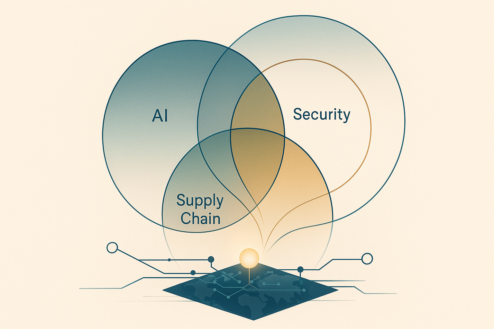

  

I am a technical CEO, operator, and systems builder focused on large-scale AI systems, security, critical minerals, and industrial manufacturing and supply chains.

AI is advancing faster than we can secure it. The United States faces a critical minerals shortage just as autonomous systems demand exponential compute. We are deploying models with hundreds of billions or even trillions of parameters into critical systems, without a clear understanding of how they fail.

The leaders who win in this environment will not be the fastest to ship features. They will be the ones who understand their systems end to end, treat supply chain resilience as core business strategy, and communicate clearly with engineering, manufacturing, and capital partners.

My career has spanned neural networks, automotive systems, large-scale manufacturing, capital raising, restructuring, and company building. That experience keeps me focused on one question: how to build systems and businesses that remain defensible under attack.

## Why Now?

Three forces converge right now:

1. **AI systems are opaque and running hot**  
   We still do not fully understand how neural network weights form, yet we are deploying these systems into safety-critical and security-sensitive domains. Security research on these models is only beginning to map the real attack surface.

2. **US critical minerals are scarce and competitors know it**  
   Mining capacity is concentrated in a few jurisdictions. Battery demand is growing exponentially. Supply chain timelines do not match AI deployment timelines. This is a hardware constraint on everything from data centers to vehicles.

3. **Deep tech leadership now requires real integration**  
   The most durable companies in this cycle will not be purely technical or purely operational. They will be led by people who understand silicon, supply chains, and capital flows, and who can align teams when the path is unclear.

The strongest moats form where these three pressures intersect.

## Where I am focused

My work centers on the junction of AI, autonomy, energy, and critical minerals, framed through questions like:

- How do we make systems observable and robust enough for real industrial and public-infrastructure use?
- How do critical minerals and manufacturing constraints reshape what is actually buildable?  
- How should boards and CEOs think about security and resilience as part of capital allocation?  

If this is the world you are working in and you want to think through it together, 🤝 [let's talk](https://www.linkedin.com/in/belmanco).
